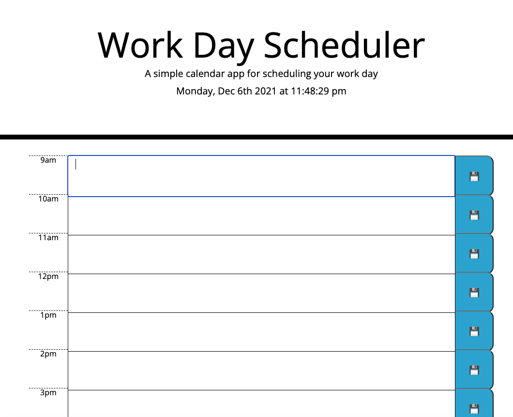

# daily-planner-
A simple daily calendar page where you can save events thorugh out hours of the day. 
The user has the time frame from 9am-5am to log daily events. 
I used HTML, CSS, Bootstrap and Jquery, to style the page's colums and to display the planner and saves information into the local storage. 
Color will be shown the display the time of day of the event. 

User Story
AS AN employee with a busy schedule
I WANT to add important events to a daily planner
SO THAT I can manage my time effectively

Acceptance Criteria
GIVEN I am using a daily planner to create a schedule
WHEN I open the planner
THEN the current day is displayed at the top of the calendar
WHEN I scroll down
THEN I am presented with timeblocks for standard business hours
WHEN I view the timeblocks for that day
THEN each timeblock is color coded to indicate whether it is in the past, present, or future
WHEN I click into a timeblock
THEN I can enter an event
WHEN I click the save button for that timeblock
THEN the text for that event is saved in local storage
WHEN I refresh the page
THEN the saved events persist

supposing your repo has latest.png inside the screenshots folder.

Live link https://l-stew206.github.io/daily-planner-/
